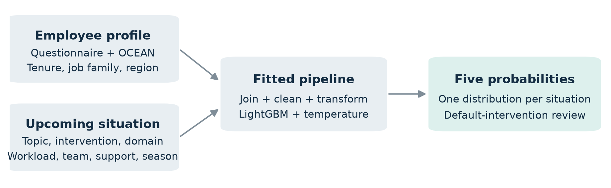
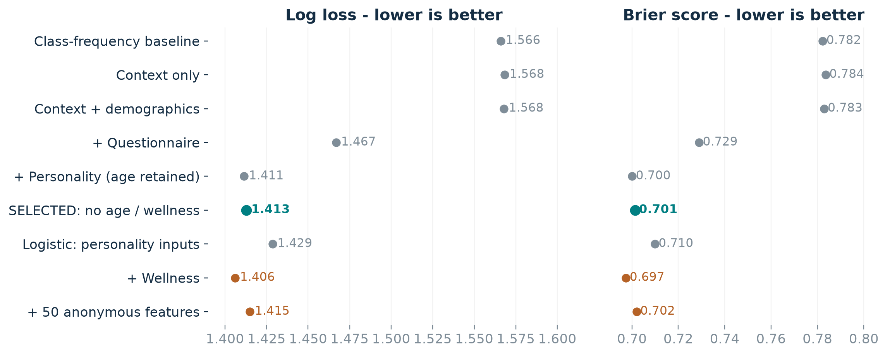
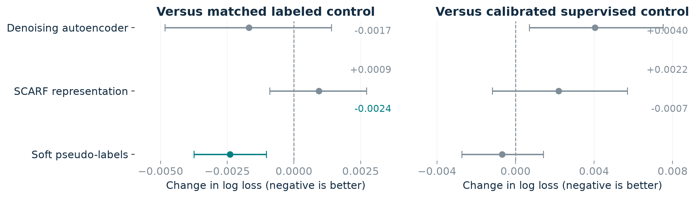
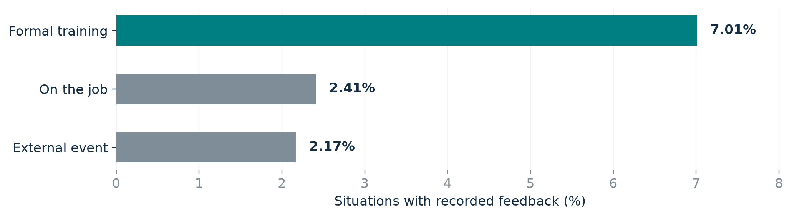
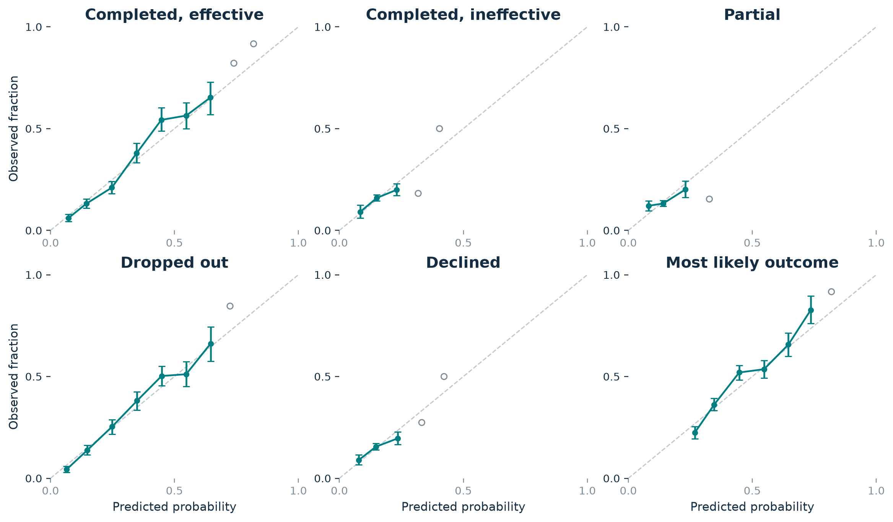
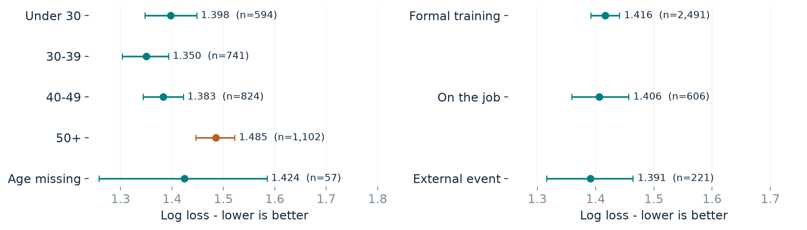
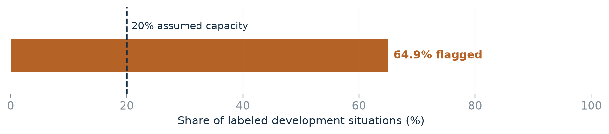
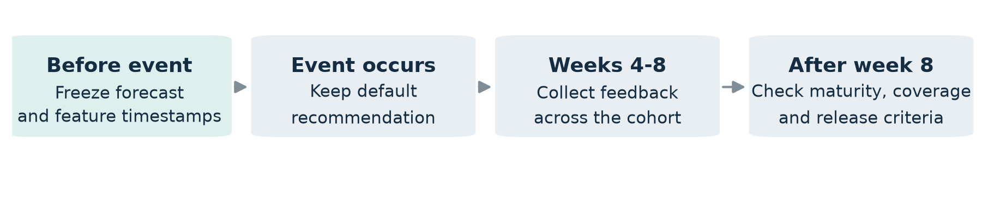

# ReAction

Behavioral response prediction | Final submission | 1 October 2026

> **DECISION: Do not deploy for live intervention decisions. Complete source validation, independent evaluation and governance review first.**

The assignment asks for **five outcome probabilities for each employee-situation pair**. The recommended intervention is an input. The forecast must help identify unsuitable default recommendations; it does not establish that changing the intervention will improve outcomes.

| Assignment requirement | Where this submission answers it |
| --- | --- |
| 1. Audit and representation | Data quality, missingness, feature contract and collection questions. |
| 2. Response prediction | Section 2: model, training strategy and supervised/unlabeled comparison; code in src/. |
| 3. Evaluation | Calibration, discrimination, age/domain slices and selection bias. |
| 4. Deployment memo | Serving, monitoring, delayed feedback, feedback loops and EU governance. |

**Inputs:** engagement questionnaire, OCEAN personality scores, optional wearable aggregates, and event context. The five intervention choices are peer workshop, self-paced video, one-to-one coaching, simulation exercise and reading pack.

Selected pipeline. All fitted transformations are learned inside the training boundary.

**Output categories:** **completed effective**, **completed ineffective**, **partial**, **dropped out** and **declined**. Probabilities sum to 100% for each situation.

**20,000** employees | **119,498** situations | **4.68%** with recorded outcomes

**Selected model:** temperature-scaled LightGBM without age or wellness inputs. Log loss is **1.413**, versus **1.566** for class frequencies. These are development estimates; independent validation remains outstanding.

---

## 1. Data audit and representation

Prediction unit: one employee in one situation

The data contain 20,000 employees, 119,498 situations and 5,587 observed outcomes. Validated person and situation keys preserve all 113,911 situations without feedback. Joins are many-to-one for employee profiles and one-to-one for recorded responses. Identifiers are used for alignment and employee grouping only. An absent response is unknown, not failure or a sixth category. Repeated events from one employee are dependent observations.

Observed outcomes are imbalanced: **dropout** has 1,522 records, **effective completion** 1,496, **ineffective completion** 905, **decline** 887 and **partial completion** 777. These counts describe feedback collection, not population outcome prevalence. The outcome rubric also requires validation: “**effective**” and “**partial**” must have consistent definitions across modules and raters before they support employee-facing decisions.

Missingness is substantial. Burnout is absent for 30.37% of employees, OCEAN scores for 6.3-6.6%, and questionnaire items for 7.1-7.9%. Wearables are structurally absent for 49.51% who did not opt in; further gaps occur among participants. HRV missingness rises from 41.4% below age 30 to 61.0% at 50+; 5.1% of opt-ins still lack HRV. These patterns separate structural opt-out, demographic selection and measurement gaps. They challenge simple missingness assumptions without identifying the unobserved-data mechanism. Missing physiology is never zero.

Four questionnaire pairs match whenever both values are observed: q01/q19, q02/q20, q09/q17 and q10/q18. Their missingness differs. Keep both raw items and their missing indicators until item provenance is resolved: dropping one would discard independently available measurements. Do not interpret duplicated items as independent psychometric evidence. HRV correlates +0.912 with sleep variability; sleep variability correlates -0.772 with burnout. Five employees have negative active minutes. Research models replace those invalid values with missingness and retain an error flag. Item keys, units and composite derivations must be checked; correlations alone do not justify recoding.

Feedback is selective. Formal training represents about half of all situations but three quarters of labels. Labeled and unlabeled records also differ on physiology, conscientiousness and burnout, with standardized mean differences around 0.19-0.23. A model of feedback observation reaches AUC 0.672 on employee-held-out data. This demonstrates observable selection; it cannot establish the distribution of unobserved outcomes.

Timing blocks deployment. Outcome timestamps extend to May 2050; 4,833 fall after the audit day. Event and feature-as-of timestamps are absent. Confirm whether dates are synthetic, shifted or incorrect. The labels remain usable for this stated modeling exercise, but no temporal deployment backtest is justified. Removing future dates without understanding their origin could introduce further bias.

The selected feature contract combines named event context, tenure, job/region, 24 questionnaire items and OCEAN. It excludes age, burnout, opt-in, wearables and anonymous context. Training-fold medians, missing indicators, scaling and categorical encoding are serialized for inference. Excluded fields are not required at serving time. Age proxies may remain; feature exclusion does not establish fairness.

---

## 2. Model and training strategy

Select probability quality; report classification separately

The study uses **3,318 labeled events from 2,891 employees**, using master seed **20261001**. Five outer folds hold out entire employees; three inner folds fit scalar temperature calibration. Preprocessing is fitted inside each boundary. Model selection uses these development data, so the scores do not constitute an independent final test.

| Historical split | Labels | Current role |
| --- | --- | --- |
| train | 3,318 | All fitting, nested calibration and reported OOF evaluation |
| tune | 899 | Excluded; historical label, no current tuning role |
| calibration | 573 | Excluded; calibration is nested within train |
| test | 797 | Excluded; not certified untouched |

Retain the historical training allocation for reproducible comparisons with earlier experiments and avoid silently changing both data and method during this review. The other 2,269 labels remain excluded, even though prior development exposure prevents treating them as independent. This is a conservative artifact-maintenance choice, not an optimal use of scarce labels. After the protocol is finalized, an all-label refit would require a new version and external validation. Existing predictions must not be presented as its evaluation.

Tree models use 100 boosting rounds, seven leaves, at least 40 samples per leaf, learning rate 0.05 and L2 penalty 10. The logistic baseline uses C=0.1. The class-frequency baseline estimates five probabilities from each training fold. All comparisons preserve employee separation.

---

## 2. Feature selection and final model

Representation ablations and the selected calibrated artifact

Calibrated development scores. Lower is better. Teal marks the selected model; orange marks models using wellness or undefined context features.

Questionnaires and personality provide the main measured gains. Adding questionnaires reduces log loss by **0.101**; adding personality reduces it by **0.056**. Context alone does not outperform class frequencies. Restoring the 50 anonymous features worsens log loss by **0.009**.

Wellness improves log loss by **0.005** relative to the age-inclusive personality model, but its Brier interval includes zero. It is excluded pending purpose and legal review. The anonymous fields are excluded pending definitions and feature timing.

Among eligible models, choose the least demanding feature set whose paired upper interval stays within **0.010 log loss** and **0.005 Brier** of the best eligible model. The age-omitting personality model meets these development margins. They are proposed engineering tolerances, not a confirmatory non-inferiority result.

The final artifact is fitted on the training labels with temperature **1.053**. It returns the same five outcomes in a fixed order. Macro-F1 is diagnostic; it does not override the probability objective.

---

## 2. Supervised-only versus unlabeled-data training

Selected inputs, identical folds and the same calibration procedure

The follow-up uses the selected age/wellness-free contract and repeat 0 of the same five employee outer folds. Each arm fits its own scalar temperature on the same three inner employee folds. SSL fitting excludes both outer and inner held-out employees from labeled and unlabeled pools. The supervised arm exactly reproduces the original selected-model predictions. Method choice follows earlier research, so this remains post-review development evidence.

> **TRAINING DECISION: retain supervised learning. Adding unlabeled pseudo-labels does not establish an improvement over the supervised baseline.**

| Primary comparison (calibrated) | Log loss | Brier |
| --- | --- | --- |
| Supervised | 1.4128 | 0.7014 |
| Supervised + unlabeled pseudo-labels | 1.4116 | 0.7008 |

Adding unlabeled pseudo-labels changes log loss by **-0.0012 (95% interval [-0.0032, +0.0008])** relative to supervised-only training. Lower is better; the interval crosses zero, so this does not establish an improvement. It also misses the proposed 0.002 minimum mean gain. Unlabeled inputs still support coverage and missingness audits; they are not used to fit the final selected model.

### Supporting controls

| Additional calibrated arm | Log loss | Brier |
| --- | --- | --- |
| Matched soft-target, labeled only | 1.4156 | 0.7027 |
| Person-only supervised | 1.4328 | 0.7110 |

Against the matched labeled-only soft-target learner, the change is -0.0040 (95% interval [-0.0064, -0.0017]). This isolates the effect of extra unlabeled inputs within that learner. It improves that control, but does not establish superiority over ordinary supervised learning.

Adding event context to person-only supervised inputs changes log loss by -0.0200 (95% interval [-0.0267, -0.0134]). This directly supports combining person and situation features, even though context alone is weak. Both arms use the same learner, folds and calibration procedure.

Intervals are paired employee bootstraps conditional on saved fits. This one-repeat follow-up is separate from the historical ten-repeat research experiment and does not correct for historical method search. Training and reproduction code is src/compare_training_strategies.py; outputs are in results/revision/.

---

## 2. Historical unlabeled-data experiments

Use unlabeled inputs without inventing outcomes

Unlabeled situations support coverage analysis, missingness analysis and three training experiments: denoising features, SCARF-style contrastive features and soft pseudo-labels. Held-out employees are excluded from each fitting pool. These historical research arms include age and wellness and were not separately calibrated. Their results apply to that configuration. The selected-contract comparison in the preceding section addresses this limitation; its evidence supports retaining supervised learning.

These abandoned research branches, their supervised controls, code and saved results are preserved in archive/historical_research/. They are retained as historical evidence, separate from the active selected-contract follow-up.

Each method has a matched labeled-only control. This separates the effect of additional unlabeled inputs from the effect of changing the learner or representation. Soft targets retain all five teacher probabilities; their total training weight is capped at 30% of the real-label weight.

Mean log-loss changes with conditional 95% employee-bootstrap intervals across ten development repetitions. Intervals crossing zero do not establish improvement.

Soft pseudo-labels change log loss by **-0.0024** against their matched control and **-0.0007** against the calibrated supervised control. The latter 95% interval is **[-0.0027, +0.0014]**, spanning zero. Negative changes favor pseudo-labels. Research arms were not separately calibrated; this comparison cannot establish superiority after common calibration.

---

## 3. Evaluation scope and representativeness

Development estimates under selective feedback

The study uses **3,318 labeled events from 2,891 employees**, using master seed **20261001**. Five outer folds hold out entire employees; three inner folds fit scalar temperature calibration. Preprocessing is fitted inside each boundary. Model selection uses these development data, so the scores do not constitute an independent final test.

The 3,318 labels are the historical 60% employee training allocation. The remaining 2,269 labels are excluded to preserve comparability with prior fits; their old tune/calibration/test names no longer imply those roles. No historical allocation is certified untouched. This sacrifices data efficiency and does not restore independence. Section 2 gives split counts and the supervised-versus-unlabeled comparison.

Feedback coverage differs by more than threefold across domains. Collection questions and responsible owners appear in Section 4.

### Representativeness sensitivity

An employee-held-out observation model estimates the probability that feedback is recorded. Inverse-probability weighting assumes conditional independence of outcome and observation, sufficient coverage and an adequate observation model. Those assumptions are unverified.

| Evaluation weighting | Log loss | Brier | Effective events |
| --- | --- | --- | --- |
| Unweighted | 1.413 | 0.701 | 3,318 |
| Inverse probability; floor 0.01 | 1.407 | 0.699 | 2,416 |
| Domain post-stratification | 1.409 | 0.700 | 2,474 |

Weighting is a sensitivity check, not corrected ground truth. Effective counts measure weight concentration, not independent employees. The next collection must sample feedback independently of model flags and track invitations, reminders, maturity and nonresponse.

---

## 3. Calibration and discrimination

A fitted calibrator is not a calibration guarantee

| Probability metric | Before scaling | After scaling |
| --- | --- | --- |
| Log loss - lower is better | 1.4127 | 1.4128 |
| Brier - lower is better | 0.7010 | 0.7014 |
| Classwise calibration error | 1.85% | 2.05% |
| Top-label calibration error | 3.09% | 3.56% |

Temperature scaling slightly worsens the point estimates. Its paired log-loss change is +0.0001 (95% interval [-0.0013, +0.0015]); Brier change is +0.0004 (95% interval [-0.0004, +0.0012]). Both intervals span zero. Keep the declared procedure without selecting a replacement on these outer folds. Temperature-scaled does not mean calibration is established. The prior baseline has little binned calibration error but no individual discrimination.

Solid markers: at least 100 events and 50 employees. Error bars: conditional 95% employee-bootstrap intervals. Hollow markers: sparse bins; descriptive only. The diagonal denotes agreement.

**43.1%** accuracy | **0.285** macro-F1 | **0.659** macro OVR AUC

Balanced accuracy is **0.333**. Several classes have weak argmax recall. Their probability quality and operational use need class-specific review; low recall alone does not prove that the probabilities are unusable.

Intervals condition on the fitted models and bin definitions. They do not cover all model-selection or refitting uncertainty. Sparse all-success or all-failure bins cannot support reliability claims.

---

## 3. Class and cohort diagnostics

Probability quality and discrimination require separate interpretation

| Outcome | n | Precision | Recall | F1 |
| --- | --- | --- | --- | --- |
| completed effective | 904 | 47.8% | 73.7% | 0.580 |
| completed ineffective | 539 | 22.4% | 5.9% | 0.094 |
| partial | 457 | 17.6% | 3.9% | 0.064 |
| dropped out | 903 | 45.0% | 74.0% | 0.559 |
| declined | 515 | 23.5% | 8.9% | 0.129 |

Argmax recall is below 9% for ineffective completion, partial completion and decline. The model mainly predicts effective completion or dropout as its most likely outcome. This restricts label-based use; useful probability forecasts still require classwise reliability and proper-score evidence.

| Age / domain | n | Log loss [95% interval] | AUC | Top ECE |
| --- | --- | --- | --- | --- |
| <30 | 594 | 1.398 [1.347, 1.448] | 0.680 | 5.4% |
| 30–39 | 741 | 1.350 [1.303, 1.393] | 0.678 | 6.5% |
| 40–49 | 824 | 1.383 [1.343, 1.422] | 0.664 | 3.7% |
| 50+ | 1,102 | 1.485 [1.446, 1.522] | 0.630 | 5.6% |
| missing | 57 | 1.424 [1.258, 1.585] | 0.683 | 11.6% |
| formal training | 2,491 | 1.416 [1.392, 1.441] | 0.655 | 3.4% |
| on the job | 606 | 1.406 [1.359, 1.457] | 0.646 | 4.5% |
| external event | 221 | 1.391 [1.316, 1.464] | 0.675 | 6.4% |

AUC is macro one-versus-rest discrimination; ECE is ten-bin top-label calibration error. Log-loss intervals resample employees, conditional on the existing fits. AUC/ECE are descriptive point estimates without uncertainty intervals. The missing-age and external-event groups are particularly imprecise. Differences in outcome mix and selective feedback prevent interpreting raw loss gaps as a fairness verdict. Class/cohort calibration bins and employee counts are retained in results/model/.

---

## 3. Cohorts and decision policy

Unequal performance and excessive review volume block release

Selected model. Bars show conditional 95% employee-bootstrap log-loss intervals; n denotes labeled situations. These estimates do not include refit or model-selection uncertainty.

The **50+** cohort has the highest age-group loss despite age being excluded. External events have 221 labeled examples. Age-by-domain, intervention and opt-in diagnostics are included in the result files. These analyses do not establish fairness.

Opt-out and opt-in log losses are **1.414** and **1.411**. Restricted audit attributes must remain separate from ordinary serving logs. Removing age or wellness predictors does not remove every proxy or collection effect.

### Tested shadow policy

Illustrative assumptions: flag the default intervention when **P(completed effective) < 30%**, with review capacity set to 20%. Neither value is product-approved. The policy groups all other outcomes as “**not effective completion**” for diagnosis; it does not assume equal business costs and does not rank alternative interventions.

Labeled development cases only. The illustrative threshold exceeds assumed 20% capacity and is rejected for live use.

| Policy diagnostic | Result |
| --- | --- |
| Flagged labeled development situations | 64.9% |
| **Not effective** among flagged cases | 86.7% |
| Sensitivity to **non-effective completion** | 77.3% |
| **Effective completions** incorrectly flagged | 31.7% |

**1,007 labeled events from 900 employees** lie within 10 percentage points of the threshold. Operational workload must count all forecasts. Product owners must approve costs, capacity and thresholds before prospective evaluation; retuning on evaluation outcomes cannot establish success.

---

## 4. Deployment design memo

A controlled shadow workflow with explicit ownership

Release requires validated timestamps, outcome definitions, independent evidence and governance approval. Start with a silent shadow run on scheduled L&D events. A daily EU-hosted batch job must join approved person/context snapshots, validate the schema, load the versioned artifact and store five probabilities with situation ID, model hash, forecast time and policy version. Keep the live recommendation unchanged. Do not expose individual shadow scores to managers.

The selected service needs no age, burnout, opt-in or wearable inputs. Keep audit attributes in a separate restricted store. Warm local p95 inference, including cleaning and transformation, measured 11.8 ms for one event, 13.5 ms for 100 and 25.0 ms for 1,000 over 30 repetitions. These timings exclude retrieval, transport, cold start and concurrency. Proposed service targets are p95 below 100 ms and 99.5% availability; the platform owner must verify them under load.

Schema or join failures must preserve the default recommendation and log a reason code. Enforce measurement bounds and event-category values; impute legitimate missing measurements. New job families or regions remain encodable and trigger monitoring. Alert the platform owner if failures exceed 1% or p95 exceeds 100 ms over 15 minutes. The data owner must investigate new categories or missingness increases above five percentage points. Monitor weekly probability distributions, flag volumes and feature drift against the frozen reference; changes above five percentage points prompt review. Track maturity, coverage and nonresponse by cohort. These signals require investigation, not automatic retraining. Maintain versioned artifacts and a tested rollback procedure.

Freeze forecasts before feedback is available. Close each cohort no earlier than eight weeks after its last event. Record invitation, reminder, response and maturity timestamps; pending feedback must remain unknown. Evaluate loss, Brier, reliability and age/domain slices only after planned support and coverage are met. The model owner must approve retraining and a newly frozen comparison. Late feedback belongs in a separately versioned review, never an overwritten forecast.

Collect feedback across the population independently of model flags. Record the actual intervention, recommendation policy, human overrides and reasons. Otherwise, the model changes the data that train its successor and can reinforce its own errors. Alternative matching requires a separate study. Employees need a clear purpose explanation, a correction route, and a way to challenge consequential use with meaningful human oversight.

Before employee shadow processing, the controller must document whether a GDPR Article 35 DPIA is required and complete it where required, with DPO advice and employee-representative consultation [4]. Approve purpose, lawful basis, minimization, access and retention. A six-month restricted retention period is proposed, subject to review and deletion-rights handling. Employment power imbalance limits reliance on consent [1]. Any health-related inputs require separate assessment of applicable special-category conditions [2]. Assess intended use against AI Act Annex III employment provisions. If it falls within Annex III and profiles people, Article 6(3) treats it as high-risk; the L&D label or human review does not itself create an exemption [3]. Legal counsel must verify applicable obligations and dates. Statistical acceptance does not supply legal approval.

Labels arrive 4-8 weeks after the event. Pending feedback remains unknown throughout the cycle.

---

## 4. Release requirements

Required evidence, accountable owners and reproducible delivery

| Unresolved question | Required action / owner |
| --- | --- |
| Are dates valid and features available before each event? | Certify event and feature timestamps; explain future dates. Data engineering. |
| What constitutes **effective completion** or **partial completion**? | Approve a common rubric and double-code a sample. L&D. |
| Are psychometric fields correctly defined? | Check item keys, duplicate pairs, units and derived scores. Measurement owner. |
| Who is invited to provide feedback, and when? | Document sampling, reminders and maturity. L&D operations. |
| What decision is permitted and affordable? | Approve costs, review capacity, legal purpose and access. Product + DPO. |

### Independent evaluation

No independent final cohort has been evaluated. For future validation, recruit employees absent from the supplied population and record features before forecasts and forecasts before events. Freeze model, code, input and prediction hashes; reject changed records and evaluate only after outcomes mature.

Proposed minimums are **2,000 labeled events, 1,000 employees and 100 examples per outcome**. Each required age/domain slice needs at least 100 events, 50 employees and 80% feedback coverage. Outcome metrics remain withheld until those minimums are met.

Require at least **0.002 lower log loss** than the frozen class-prior comparator, with a paired interval below zero; Brier deterioration must remain within 0.005. Supported class/cohort reliability intervals must remain within +/-10 percentage points. The policy must fit review capacity. Approve these proposed tolerances and complete a precision/power review before recruitment.

### Submission contents

Submit the complete folder. README.md documents reproduction; data/ holds unchanged inputs; src/ contains Tasks 1-2; results/ contains models and evidence; scripts/ rebuilds the report. This report covers all four tasks. Include archive/historical_research/ for the historical comparisons cited here.

**Reproducibility:** use seed 20261001. Input/split hashes are in results/splits/manifest.json; the artifact hash is in results/model/model_card.json. CSV/JSON results retain full precision; report values are rounded.

### Sources

[1] [EDPB: lawful processing and employee consent](https://www.edpb.europa.eu/sme/be-compliant/process-personal-data-lawfully_en).

[2] [European Commission: legal grounds and sensitive data](https://commission.europa.eu/law/law-topic/data-protection/information-business-and-organisations/legal-grounds-processing-data_en).

[3] European Commission AI Act Service Desk: [Article 6](https://ai-act-service-desk.ec.europa.eu/en/ai-act/article-6) and [Annex III](https://ai-act-service-desk.ec.europa.eu/en/ai-act/annex-3).

[4] [EDPB: data protection impact assessment](https://www.edpb.europa.eu/topics/accountability-and-compliance-tools/data-protection-impact-assessment_en).
